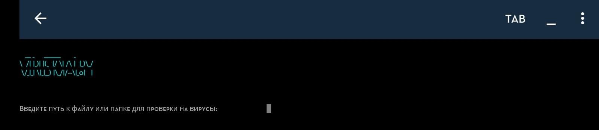
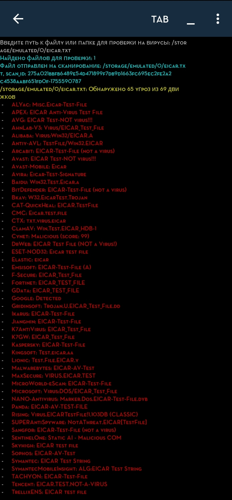
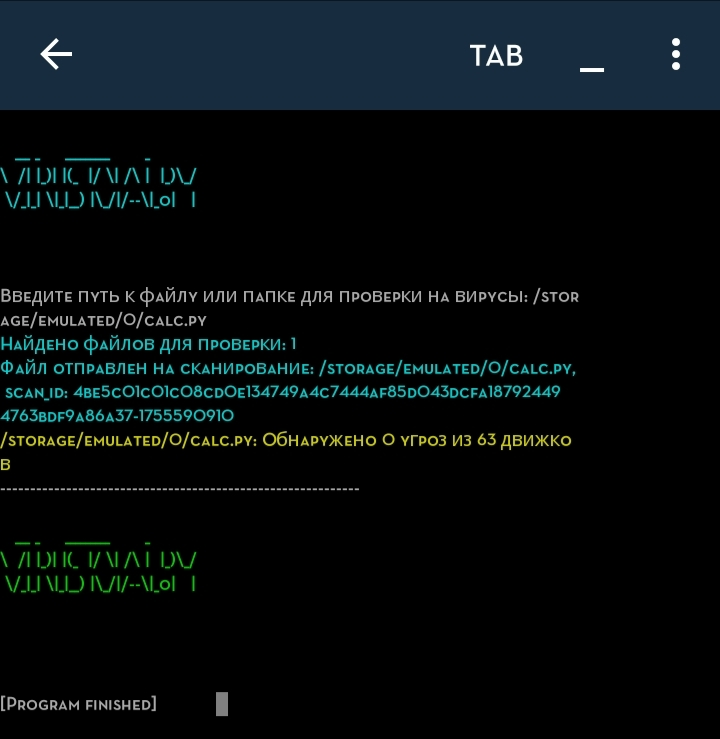

# VIRUSTOTAL.PY

Красивый и простой Python-скрипт для проверки файлов и папок на вирусы с использованием API VirusTotal. Подходит для запуска на Android (Termux, PyDroid3) с удобным цветным выводом статуса и подробными отчетами.

---

## Особенности

- Принимает путь к файлу или папке для рекурсивного сканирования всех файлов.
- Отправляет файлы на проверку в VirusTotal и запрашивает результаты.
- Цветной, яркий баннер и информативный вывод статуса (синий при старте, красный при обнаружении вирусов, зелёный при чистой проверке).
- Поддержка больших и удобочитаемых шрифтов ASCII-арта (mini).
- Реализован механизм ожидания результатов с учётом лимитов Api (интервал 5 секунд. При необходимости можете изменить)
- Вывод детальной информации по каждому антивирусному движку, обнаружившему угрозы.
- Работает без root с учётом ограничений доступа к файлам на Android.
- Использует библиотеки [pyfiglet](https://github.com/pwaller/pyfiglet) для ASCII-арта и [colorama](https://github.com/tartley/colorama) для цветов в консоли.

---

## Установка

1. Склонируйте репозиторий:
git clone https://github.com/zyphralex/VIRUSTOTAL.PY.git
cd VIRUSTOTAL.PY

2. Установите зависимости:
pip install pyfiglet colorama requests

3. Вставьте ваш VirusTotal API ключ в переменную `API-KEY-VIRUSTOTAL` в коде.

---

## Использование

Запустите скрипт:

python3 VIRUSTOTAL.py

В появившемся приглашении введите путь к файлу или папке для проверки, например:

/storage/emulated/0/Download (лучше указывать на 1 файл если у вас бесплатный API)

Скрипт рекурсивно проверит все файлы в папке и выведет результаты с цветным баннером и подробным отчетом.

---

## Ограничения

- Бесплатный API VirusTotal ограничивает 4 запросами в минуту, поэтому между проверками выставлен промежуток ожидания (по умолчанию 5 секунд).
- При больших объемах файлов сканирование может занять длительное время.
- Для более частого и масштабного сканирования рекомендуется использовать платную версию API.

---

## Тестовый файл

Для проверки работы используйте тестовый файл [EICAR](https://www.eicar.org/?page_id=3950).

Создайте его командой в терминале Python:

with open("eicar.txt", "w") as f:
f.write("X5O!P%@AP[4\PZX54(P^)7CC)7}$EICAR-STANDARD-ANTIVIRUS-TEST-FILE!$H+H*")
print("Тестовый файл eicar.txt создан.")

Либо скачайте прикрепленый файл eicar.txt

---

## Скриншоты

### Termux

### PyDroid3

---

Если возникнут вопросы или пожелания — создавайте issue или пишите Pull Request!
